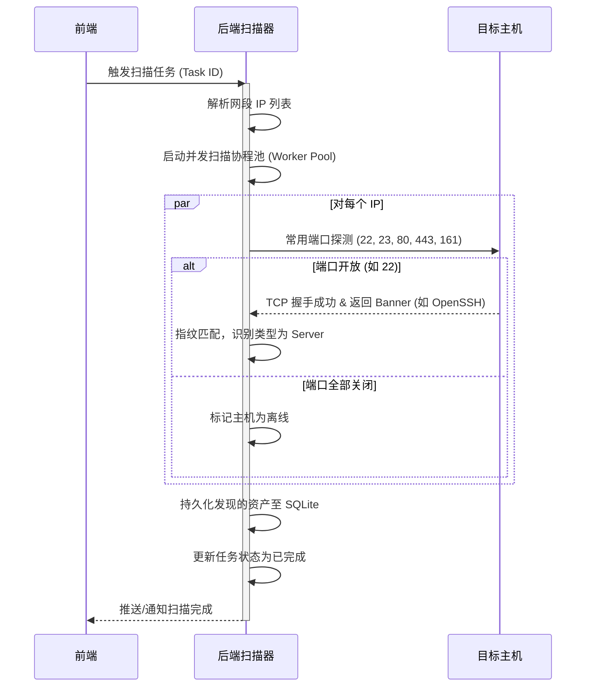
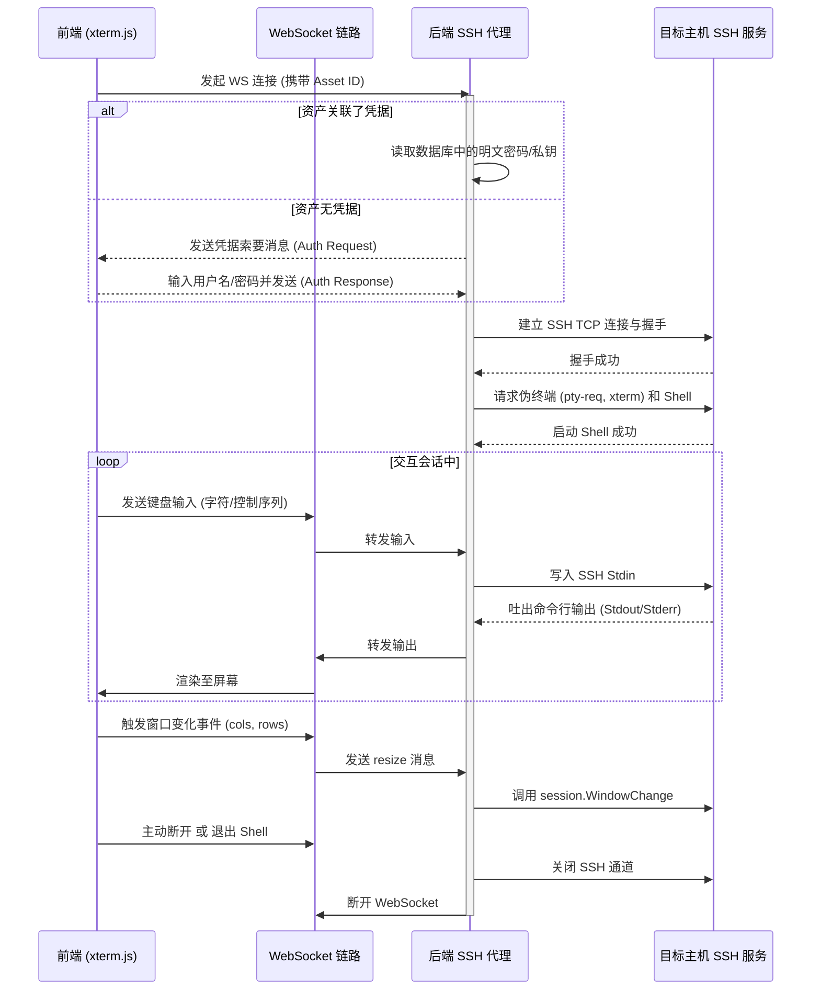
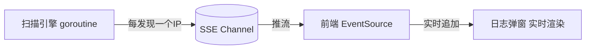

# 资产管理系统 架构设计文档 (Architecture Design)

本文档描述了资产管理系统的整体技术架构、模块职责、以及关键机制的实现逻辑。

---

## 1. 整体架构图

本系统采用经典的前后端分离架构，但整体作为单体（Monorepo）方式部署，依赖轻量级的 SQLite 存储数据，实现全栈自包含。

---

## 2. 模块职责说明

### 2.1 前端 (Frontend)
- **UI 框架**：React 18 + TypeScript + Vite + Ant Design 5。
- **Dashboard**：显示当前资产的分类数据、在线率统计以及最近扫描任务的状态。
- **资产列表 (CMDB)**：提供资产的列表展示、详情抽屉、手动录入与修改，以及一键调起终端（WebSSH）。
- **任务管理**：配置扫描的 IP 网段和端口，手动启动扫描，查看扫描日志。
- **凭据保管箱**：集中录入并管理用于扫描与连接的账号密码或私钥。
- **网页终端 (WebSSH)**：集成 `xterm.js`，通过 WebSocket 与后端进行双向输入输出交互，支持终端自适应缩放（Resize）。

### 2.2 后端 (Backend)
- **Web 服务与 API**：Gin 框架负责路由分发、API 鉴权与业务接口。
- **扫描引擎 (Scanner Engine)**：
  - **网段解析**：将 IP 范围/掩码（如 `192.168.1.0/24` 或 `10.0.0.1-10.0.0.50`）转换为待扫描 of IP 列表。
  - **并发调度**：采用 Go Worker Pool 并发模型，控制最大并发连接数（如同时扫描 100 个 IP/端口），避免耗尽系统句柄。
  - **服务探测与类型判定**：通过 TCP 三次握手测试端口存活，并获取连接的初始 Banner（如 OpenSSH 标识、交换机登录 Banner 等），推断设备类型。
- **WebSSH 代理 (SSH Proxy)**：
  - 作为桥梁接收来自前端的 WebSocket 流量。
  - 利用 `golang.org/x/crypto/ssh` 建立到目标资产的真实 SSH 连接。
  - 启动远程 PTY 并建立双向管道。
  - 当资产没有绑定凭据时，在 WebSocket 连接建立之初交互式询问用户凭据。
- **数据持久化 (Store & ORM)**：使用 GORM 配合 SQLite 存储资产、凭据、任务和日志数据。

---

## 3. 核心流程设计

### 3.1 资产自动发现流程 (Auto-Discovery Flow)

### 3.2 WebSSH 交互流程 (WebSSH Proxy Flow)

---

## 4. 安全性与容错考虑

1. **凭据安全**：本版本直接使用明文字符串保存密码与私钥。在生产环境中应引入 AES 对称加密存储，并使用 KMS 管理密钥。
2. **扫描并发控制**：网络扫描使用超时时间（如 2 秒超时），并对并发连接总数进行限制，防止在扫描大网段时引起系统 OOM 或进程句柄耗尽崩溃。
3. **WebSSH 异常处理**：若目标主机网络闪断或会话超时，后端将及时捕获异常并关闭 WebSocket，通知前端清空终端状态，防止孤儿 SSH 会话占用后端系统资源。

---

## 5. 数据模型总览（v2.0）

| 模型 | 表名 | 主要字段 | 版本 |
|------|------|----------|------|
| Asset | assets | id, name, ip, type, status, vendor, os_version, ports, **tags**, description, credential_id, last_scanned_at | v1 + v2新增 tags |
| Credential | credentials | id, name, type, username, password, private_key | v1 |
| ScanTask | scan_tasks | id, name, target_range, ports, **schedule**, status, last_run_at | v1 + v2新增 schedule |
| ScanLog | scan_logs | id, task_id, status, started_at, finished_at, summary, detail | v1 |
| ActivityLog | activity_logs | id, type, message, ref_id, created_at | **v2 新增** |
| SystemSetting | system_settings | key, value | **v3 计划** |

---

## 6. 前端路由规划（v2.0）

引入 `react-router-dom v6` 后，各页面映射到独立 URL，支持浏览器前进/后退和直接 URL 访问：

| URL 路径 | 组件 | 说明 |
|----------|------|------|
| `/` | `Dashboard` | 控制台首页 |
| `/assets` | `Assets` | 资产管理 (CMDB) |
| `/tasks` | `ScanTasks` | 自动发现扫描任务 |
| `/credentials` | `Credentials` | 凭据管理 Vault |
| `/settings` | `Settings` | 系统设置（Phase 1 骨架） |
| `/terminal/:id` | `TerminalPage` | 独立标签页 WebSSH 终端 |

---

## 7. Phase 2 架构扩展：SSE 实时推送

Phase 2 将在扫描引擎中引入 **Server-Sent Events (SSE)** 单向推流机制，替代前端轮询：

选用 SSE 而非 WebSocket 的原因：
- 扫描进度是**单向**服务端推流，不需要客户端回写
- SSE 自带**断线重连**机制，浏览器原生支持
- 实现更简单，不依赖 gorilla/websocket
