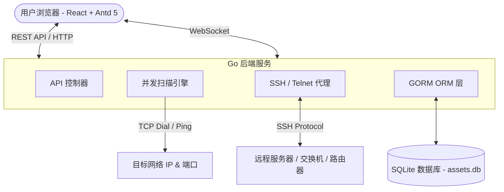
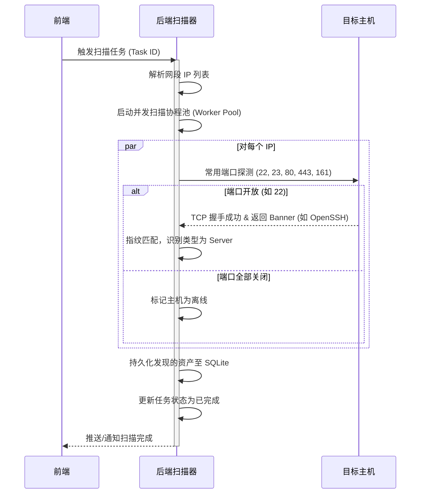
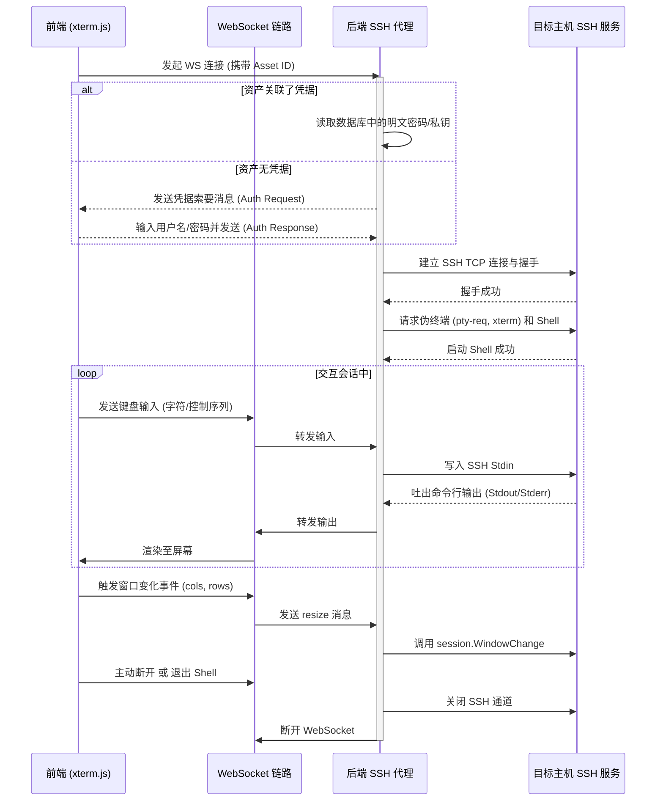
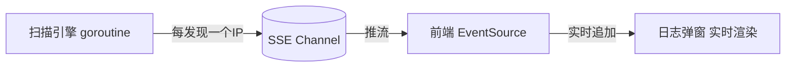

# Meridian 架构设计文档 (Architecture Design)

> **产品**: Meridian · 子午 — 网络资产发现与统一接入平台

本文档描述了 Meridian 的整体技术架构、模块职责、以及关键机制的实现逻辑。

---

## 1. 整体架构图

本系统采用经典的前后端分离架构，但整体作为单体（Monorepo）方式部署，依赖轻量级的 SQLite 存储数据，实现全栈自包含。

---

## 2. 模块职责说明

### 2.1 前端 (Frontend)
- **UI 框架**：React 18 + TypeScript + Vite + Ant Design 5；集中式设计令牌 `theme.ts`，复用 `PageHeader`/`Logo`/`UserMenu`/`GlobalSearch`。
- **登录门禁**：未登录跳转登录页（默认 admin/admin），右上角用户菜单提供登出。
- **Dashboard**：资产分类数据、在线率环图、资产类型分布、最近活动时间线（定高滚动）、5s 轮询。
- **资产列表 (CMDB)**：列表/详情抽屉/手动录入修改、一键调起终端、在线探测、**认证采集（架构/虚拟化）、分组、批量探测删除、导出 CSV、字段级变更历史**。
- **任务管理（自动发现）**：配置网段/端口/扫描类型（discovery/vuln）/**定时计划**，启动/停止扫描，**SSE 实时日志**与历史回看。
- **漏洞发现**：展示 nuclei 漏扫结果（严重程度着色）。
- **凭据保管箱**：SSH 密码/密钥/Telnet 的录入管理 + **连通性测试**。
- **系统设置**：扫描并发/超时等参数真实读写。
- **网页终端 (WebSSH / Telnet)**：集成 `@xterm/xterm`，WebSocket 双向交互、自适应缩放、**应用内多标签、全屏、滚动回看**。
- **全局搜索**：Ctrl/Cmd + K 检索资产与页面跳转。

### 2.2 后端 (Backend)
- **Web 服务与 API**：Gin 框架负责路由分发与业务接口（登录、资产、凭据、任务、设置、漏洞、活动、SSE、WebSocket）。
- **扫描引擎 (Scanner Engine)** — 可插拔分发（`engine.go`）：按任务 `kind` 选择 **discovery（端口发现）** 或 **vuln（nuclei 漏扫）**；入口含 `panic` 恢复，单次扫描崩溃不会拖垮整个服务。
  - **网段解析**：将 IP 范围/掩码（`192.168.1.0/24` 或 `10.0.0.1-10.0.0.50`）展开为 IP 列表（带最大数量与速率限制）。
  - **并发调度**：Go Worker Pool 控制最大并发；并发数与超时由**系统设置**驱动，大网段额外限流。
  - **服务探测与类型判定**：TCP 探活 + Banner 指纹（OpenSSH、交换机登录 Banner、HTTP Server 头）推断设备类型/厂商；发现即增量入库，扫描结束清扫离线资产。
- **漏洞扫描 (nuclei)**：`nuclei.go` 调用外部 `nuclei` 二进制，结果落 `VulnFinding`；二进制缺失时优雅降级。
- **认证采集 (Collect)**：对绑定凭据的资产建立 SSH 会话执行 `uname -m; uname -sr` 取架构/内核，并以 `systemd-detect-virt`（回退 `/proc/cpuinfo` hypervisor 位 + DMI `product_name`）判定**虚拟化/云/容器**。
- **定时调度 (Scheduler)**：`scheduler.go` 自包含轮询（每 30s），支持 `@every 15m` 与 `daily:HH:MM`，无外部 cron 依赖。
- **终端代理 (SSH / Telnet Proxy)**：`sshproxy.go` 用 `golang.org/x/crypto/ssh` 建真实 SSH 连接、起 PTY 并双向管道；`telnet.go` 处理 Telnet IAC 协商。资产无凭据时在连接之初交互式索要。
- **数据持久化 (Store & ORM)**：GORM + **glebarez/sqlite（纯 Go，免 cgo）**，启动 `AutoMigrate` 全部模型并写入默认设置（含 admin/admin）。

---

## 3. 核心流程设计

### 3.1 资产自动发现流程 (Auto-Discovery Flow)

### 3.2 WebSSH 交互流程 (WebSSH Proxy Flow)

---

## 4. 安全性与容错考虑

### 当前实现
1. **扫描并发控制**：探测带超时（默认 2s），并发总数受限、大网段限流，避免扫描时 OOM / 句柄耗尽。
2. **扫描健壮性**：扫描在独立 goroutine 中运行并带 `panic` 恢复，崩溃时将任务/日志标记为失败而非拖垮服务。
3. **终端异常处理**：目标闪断/超时时及时关闭 WebSocket 与底层 SSH/Telnet 会话，前端展示「会话已断开」，避免孤儿会话占用资源。
4. **登录门禁**：`POST /api/login` 校验（默认 admin/admin，可在 `system_settings` 改），前端以此做访问门禁。

### 有意延后的设计取舍（当前为本地单用户工具，非缺陷）
> 自动化审计会反复将其标为高危；在用户明确要求加固前不擅自重写。
1. **凭据明文存储**：密码/私钥以明文存于 SQLite（界面已显式说明）。生产应引入 AES-at-rest + KMS。
2. **无服务端鉴权中间件**：登录 token 为静态占位、未在受保护路由校验，鉴权目前仅在前端。后续可加会话/JWT 中间件 + RBAC。
3. **SSH 主机密钥未校验**：`ssh.InsecureIgnoreHostKey()`，后续可接入 known_hosts 校验。

---

## 5. 数据模型总览（v4.0）

| 模型 | 表名 | 主要字段 | 状态 |
|------|------|----------|------|
| Asset | assets | id, name, ip, type, status, vendor, os_version, **arch**, **virtualization**, ports, tags, description, credential_id, last_scanned_at | ✅ |
| Credential | credentials | id, name, type, username, password, private_key | ✅ |
| ScanTask | scan_tasks | id, name, target_range, ports, **kind**, **schedule**, status, last_run_at | ✅ |
| ScanLog | scan_logs | id, task_id, status, started_at, finished_at, summary, detail | ✅ |
| ActivityLog | activity_logs | id, type, message, ref_id, created_at | ✅ |
| SystemSetting | system_settings | key, value | ✅ |
| VulnFinding | vuln_findings | id, asset_id, target, template_id, name, severity, matched_at, engine | ✅ |
| AssetHistory | asset_histories | id, asset_id, field, old_value, new_value, created_at | ✅ |

> `arch` / `virtualization` 经认证采集写入；`kind` 区分端口发现与漏扫；全部模型在启动时 `AutoMigrate`。

---

## 6. 前端路由（v4.0）

`react-router-dom v7`，页面按路由懒加载（重型依赖 xterm.js 不进首屏主包）。未登录时由登录门禁拦截。

| URL 路径 | 组件 | 说明 |
|----------|------|------|
| `/` | `Dashboard` | 控制台首页 |
| `/assets` | `Assets` | 资产管理 (CMDB) |
| `/tasks` | `ScanTasks` | 自动发现 / 漏扫任务 |
| `/vulns` | `Vulns` | 漏洞发现列表 |
| `/credentials` | `Credentials` | 凭据管理 Vault |
| `/settings` | `Settings` | 系统设置（真实读写） |
| `/terminal/:id` | `TerminalPage` | 独立标签页 WebSSH（应用内则以标签页内嵌） |
| —（门禁） | `Login` | 未登录时渲染登录页 |

---

## 7. SSE 实时推送（已实现）

扫描日志通过 **Server-Sent Events (SSE)** 单向推流，替代前端轮询：`GET /api/tasks/:id/stream` 服务端轮询数据库增量、`flush` 推送新行与状态，前端用 `EventSource` 实时追加，扫描结束（`done` 事件）自动收尾并拉取完整历史。

选用 SSE 而非 WebSocket 的原因：
- 扫描进度是**单向**服务端推流，不需要客户端回写
- SSE 自带**断线重连**机制，浏览器原生支持
- 实现更简单，不依赖 gorilla/websocket
