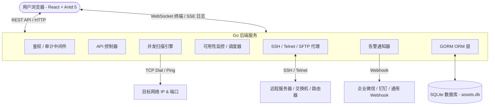
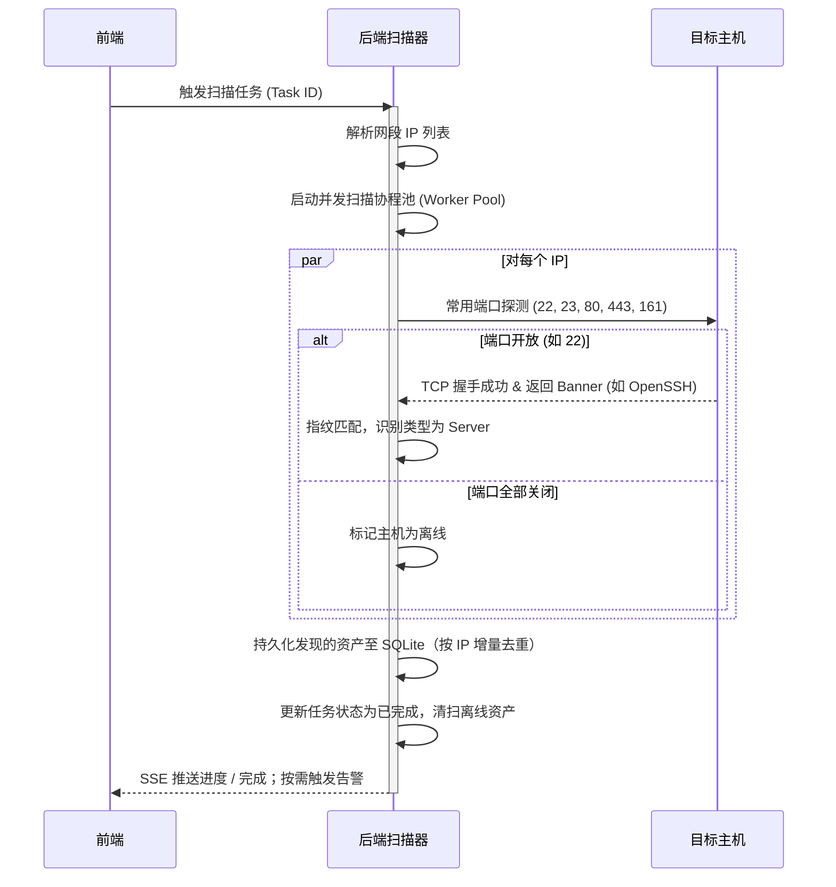
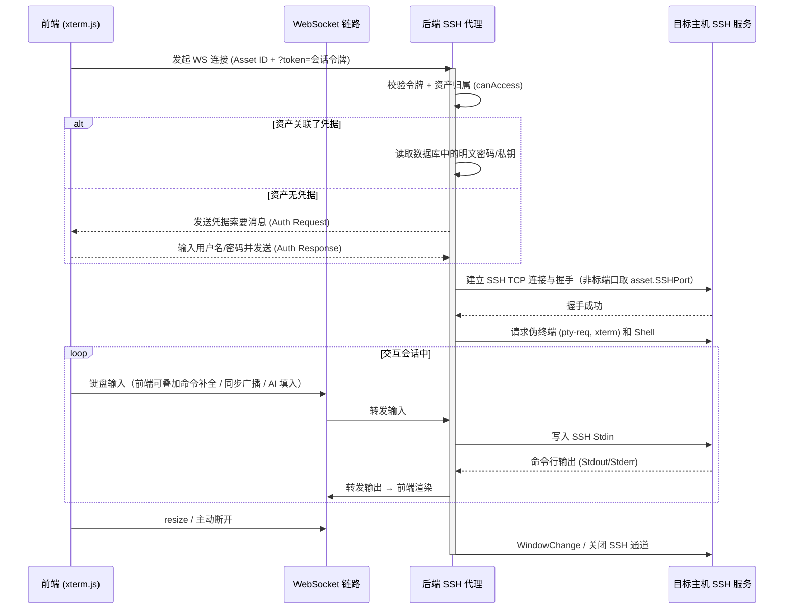
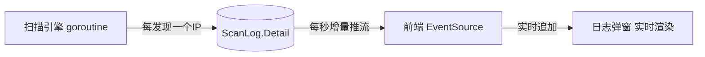

# Meridian 架构设计文档 (Architecture Design)

> **产品**: Meridian · 子午 — 网络资产发现与统一接入平台
> **文档版本**: v5.0（2026-06-23）· 对应应用版本 **v0.30**

本文档描述了 Meridian 的整体技术架构、模块职责、以及关键机制的实现逻辑。

---

## 1. 整体架构图

本系统采用经典的前后端分离架构，但整体作为单体（Monorepo）方式部署，依赖轻量级的 SQLite 存储数据，实现全栈自包含。

---

## 2. 模块职责说明

### 2.1 前端 (Frontend)
- **UI 框架**：React 18 + TypeScript + Vite + Ant Design 5；集中式设计令牌 `theme.ts`，复用 `PageHeader`/`Logo`/`UserMenu`/`GlobalSearch`。
- **鉴权与会话**：未登录跳转登录页；登录后令牌存于本地并随请求带 `Authorization: Bearer`；首次登录或被重置时跳「强制改密」页（`ForcePasswordChange`）；右上角用户菜单登出。
- **Dashboard**：资产分类数据、在线率环图、资产类型分布、最近活动时间线（定高滚动）、5s 轮询；数据按当前用户归属隔离。
- **资产列表 (CMDB)**：列表/详情抽屉/手动录入修改、一键调起终端、在线探测、认证采集（架构/虚拟化）、分组、批量探测删除、**CSV 导入/导出**、字段级变更历史、**管理员分配资产归属**、**可用性/在线率**查看、**SFTP 文件管理抽屉**（`SftpDrawer`）。
- **任务管理（自动发现）**：配置网段/端口/扫描类型（discovery/vuln）/定时计划，启动/停止扫描，SSE 实时日志与历史回看（管理员）。
- **漏洞发现**：展示 nuclei 漏扫结果（严重程度着色，管理员）。
- **凭据保管箱**：SSH 密码/密钥/Telnet 的录入管理 + 连通性测试（按归属隔离）。
- **系统设置**：扫描并发/超时、SSH 超时、**可用性监控开关/间隔**、**告警通知（企业微信/钉钉/Webhook）**、**AI 命令助手（OpenAI 兼容）** 配置真实读写（管理员）。
- **用户管理 / 审计**：`Users` 用户增删改、角色与状态（审批 pending→active）；`Audit` 操作审计查询（均管理员）。
- **网页终端 (WebSSH / Telnet)**：集成 `@xterm/xterm`，WebSocket 双向交互、自适应缩放、应用内多标签、全屏、滚动回看；**多屏分屏（单/左右双分/田字四分，可独立关闭、分隔条自由拖拽缩放）**、**命令同步广播**、**命令自动补全**（本地输入行追踪 + 内置 200+ 运维命令片段库，Tab 补全）、**AI 命令助手栏**（自然语言生成命令，确认后填入/执行）。
- **全局搜索**：Ctrl/Cmd + K 检索资产与页面跳转。

### 2.2 后端 (Backend)
- **Web 服务与中间件**：Gin 框架。全局 CORS → **审计中间件**（记录 POST/PUT/DELETE）→ **鉴权中间件**（会话令牌校验）；管理员路由叠加 **AdminMiddleware** 角色校验。
- **鉴权与多租户 (`handler/auth.go`)**：登录用 `bcrypt` 校验，签发 32 字节随机会话令牌（内存表，TTL 7 天）；令牌取自 `Authorization: Bearer` 或 `?token=`（供 WS/SSE）；上下文注入 `user_id`/`username`/`role`。`canAccess()` 实现按 `owner_id` 的多租户数据隔离。
- **用户与审批 (`handler/users.go`)**：注册（默认 `pending`）、用户 CRUD、角色（admin/user）与状态（active/disabled/pending）管理、改密；保护「最后一个管理员」不被删/禁。
- **审计 (`handler/audit.go`)**：中间件捕获写操作（actor/action/path/业务码/IP）；SFTP 与 AI 自行细粒度审计。
- **资产与采集 (`handler/handlers.go`, `assets_io.go`)**：资产 CRUD（支持 IP 范围批量、字段级历史）、CSV 导入（中英文表头别名、按 IP upsert）、TCP 在线探测（单/批量）、认证采集（`uname` + `systemd-detect-virt`）。
- **可用性监控 (`monitor/monitor.go`)**：后台每 30s 轮询，按配置间隔探测资产常用端口，写 `AssetCheck` 历史；状态翻转（上线/离线）触发告警。
- **告警通知 (`notifier/notifier.go`)**：扫描完成 / 资产离线时推送 **企业微信（markdown）/ 钉钉（text）/ 通用 Webhook（JSON）**，由系统设置开关驱动。
- **扫描引擎 (`scanner/engine.go` 等)**：可插拔分发，按任务 `kind` 选择 **discovery（端口发现）** 或 **vuln（nuclei 漏扫）**；网段解析、并发 Worker Pool、Banner 指纹判型、增量入库与离线清扫；入口含 `panic` 恢复。
- **定时调度 (`scheduler/scheduler.go`)**：自包含轮询（每 30s），支持 `@every 15m` 与 `daily:HH:MM`，无外部 cron 依赖。
- **终端 / 文件代理 (`sshproxy/`, `handler/sftp.go`)**：`sshproxy.go` 用 `golang.org/x/crypto/ssh` 建 SSH + PTY 双向管道；`telnet.go` 处理 Telnet IAC；`sftp.go` 基于 `pkg/sftp` 提供浏览/上传/下载/建删改目录（仅 SSH、全程审计）。均支持资产**非标 SSH 端口**（`asset.SSHPort`）。
- **AI 命令助手 (`handler/ai.go`)**：调用 OpenAI 兼容 `/chat/completions` 由自然语言生成命令；**仅生成不执行**，正则识别高危命令（`rm -rf`、`mkfs`、`dd`、fork 炸弹、`curl|sh` 等）；全程审计；按资产归属校验。
- **AI Agent (`handler/ai_agent.go`)**：「一句话自动完成任务」。后端以**独立 SSH 通道**逐条执行 AI 生成的命令（`CombinedOutput` + pwd 标记跨命令保留工作目录、每步超时），把退出码与输出回传模型推进，直至完成；命中高危命令暂停等待用户确认（自动执行 + 高危拦截）。会话保存完整对话历史支持**多轮上下文**；带步数上限、归属校验、全程审计（`AI_AGENT*`）。
- **数据持久化 (`store/db.go`)**：GORM + **glebarez/sqlite（纯 Go，免 cgo）**，启动 `AutoMigrate` 全部模型、播种默认设置与默认管理员（`admin/admin` + 首登强制改密）。

---

## 3. 核心流程设计

### 3.1 资产自动发现流程 (Auto-Discovery Flow)

### 3.2 WebSSH 交互流程 (WebSSH Proxy Flow)

> 命令补全、命令同步、AI 命令助手均为**前端能力**：补全与同步在浏览器侧拦截/广播 `onData`，AI 助手经 `POST /api/ai/command` 生成命令后由用户确认再写入 WS。后端终端代理本身保持透明。

---

## 4. 安全性与容错考虑

### 4.1 已实现
1. **服务端会话鉴权**：`POST /api/login` 校验 bcrypt 口令并签发令牌；受保护路由经 `AuthMiddleware` 校验，管理员路由经 `AdminMiddleware` 校验角色（WS/SSE 用 `?token=`）。
2. **多租户数据隔离**：资产 / 凭据 / 终端 / SFTP / 在线探测 / 活动按 `owner_id` 隔离（`canAccess`），普通用户仅可见与操作自己的数据。
3. **注册审批与口令安全**：开放注册但默认 `pending` 需管理员审批；登录失败 5 次锁定 10 分钟；默认 `admin/admin` 首登强制改密；改密/禁用即吊销该用户全部会话。
4. **全量审计**：所有写操作（含 SFTP/AI 细粒度）记入 `AuditLog`，管理员可查询。
5. **扫描并发控制与健壮性**：探测带超时、并发受限、大网段限流；扫描在独立 goroutine 中 `panic` 恢复，崩溃只标记任务失败而不拖垮服务。
6. **终端异常处理**：目标闪断/超时时及时关闭 WebSocket 与底层 SSH/Telnet 会话，前端展示「会话已断开」，避免孤儿会话。

### 4.2 有意延后的设计取舍（本地工具定位，非缺陷）
> 自动化审计会反复将其标为高危；在用户明确要求加固前不擅自重写。
1. **凭据明文存储**：密码/私钥以明文存于 SQLite（界面已显式说明）。生产应引入 AES-at-rest + KMS。
2. **SSH 主机密钥未校验**：`ssh.InsecureIgnoreHostKey()`（终端/SFTP/采集/测试均如此），后续可接入 known_hosts 校验。
3. **会话存于进程内存**：重启后令牌失效需重新登录；如需高可用可外置（Redis 等）。

---

## 5. 数据模型总览（v5.0，共 12 表）

启动时统一 `AutoMigrate`（`store/db.go`），模型定义见 `model/models.go`。

| 模型 | 表名 | 主要字段 | 说明 |
|------|------|----------|------|
| User | users | id, username(唯一), password(bcrypt,不导出), role(admin/user), status(active/disabled/pending), must_change_password, last_login_at, last_login_ip | 多用户/审批/锁定 |
| AuditLog | audit_logs | id, actor, action, path, status, ip, created_at | 写操作审计 |
| AssetCheck | asset_checks | id, asset_id, status, checked_at | 可用性探测历史（uptime） |
| Asset | assets | id, **owner_id**, name, ip(唯一), type, status, **ssh_port**, vendor, os_version, arch, virtualization, ports, tags, description, credential_id, last_scanned_at | 归属隔离 + 非标端口 |
| Credential | credentials | id, **owner_id**, name, type, username, password(明文), private_key(明文) | 归属隔离 |
| ScanTask | scan_tasks | id, name, target_range, ports, kind, schedule, status, last_run_at | 发现/漏扫 + 调度 |
| ScanLog | scan_logs | id, task_id, status, started_at, finished_at, summary, detail | SSE 流来源 |
| ActivityLog | activity_logs | id, type, message, ref_id, created_at | 活动时间线 |
| SystemSetting | system_settings | key, value, updated_at | 扫描/监控/通知/AI/默认账号 |
| VulnFinding | vuln_findings | id, asset_id, target, template_id, name, severity, matched_at, engine | nuclei 结果 |
| AssetHistory | asset_histories | id, asset_id, field, old_value, new_value, created_at | 字段级变更 |
| Tag | tags | id, name(唯一), color | 全局标签，重命名/删除同步到资产 |

> `arch` / `virtualization` 由认证采集写入；`kind` 区分端口发现与漏扫；`owner_id` 驱动多租户隔离；`ssh_port` 支持非标端口。

### 系统设置默认键（节选）
`scan_concurrency=100` · `scan_timeout=2` · `ssh_timeout=10` · `auth_username=admin` · `auth_password=admin` · `monitor_enabled=false` · `monitor_interval=5` · `notify_type=none` · `notify_url=` · `notify_on_scan=true` · `notify_on_offline=true` · `ai_enabled=false` · `ai_base_url=` · `ai_api_key=` · `ai_model=`

---

## 6. 前端路由（v5.0）

`react-router-dom v7`，页面按路由懒加载（重型依赖 xterm.js 不进首屏主包）。未登录由鉴权门禁拦截；首登/被重置跳强制改密页；用户/审计页仅管理员可见。

| URL 路径 | 组件 | 说明 |
|----------|------|------|
| `/` | `Dashboard` | 控制台首页 |
| `/assets` | `Assets` | 资产管理 (CMDB) + SFTP 抽屉 |
| `/tasks` | `ScanTasks` | 自动发现 / 漏扫任务（管理员） |
| `/vulns` | `Vulns` | 漏洞发现列表（管理员） |
| `/credentials` | `Credentials` | 凭据管理 Vault |
| `/users` | `Users` | 用户管理（管理员） |
| `/audit` | `Audit` | 操作审计（管理员） |
| `/settings` | `Settings` | 系统设置（扫描/监控/通知/AI，管理员） |
| `/terminal/:id` | `TerminalPage` | 独立标签页 WebSSH（应用内则以标签页内嵌，支持多屏/补全/AI） |
| —（门禁） | `Login` / `ForcePasswordChange` | 未登录渲染登录页；首登/被重置渲染强制改密 |

---

## 7. SSE 实时推送（已实现）

扫描日志通过 **Server-Sent Events (SSE)** 单向推流，替代前端轮询：`GET /api/tasks/:id/stream`（管理员，令牌走 `?token=`）服务端每秒轮询 `ScanLog.Detail` 增量、`flush` 推送新行与状态，前端用 `EventSource` 实时追加，扫描结束（`done` 事件）自动收尾并拉取完整历史。

选用 SSE 而非 WebSocket 的原因：扫描进度是**单向**服务端推流、无需客户端回写；SSE 自带**断线重连**且浏览器原生支持；实现更简单，不依赖 gorilla/websocket。
